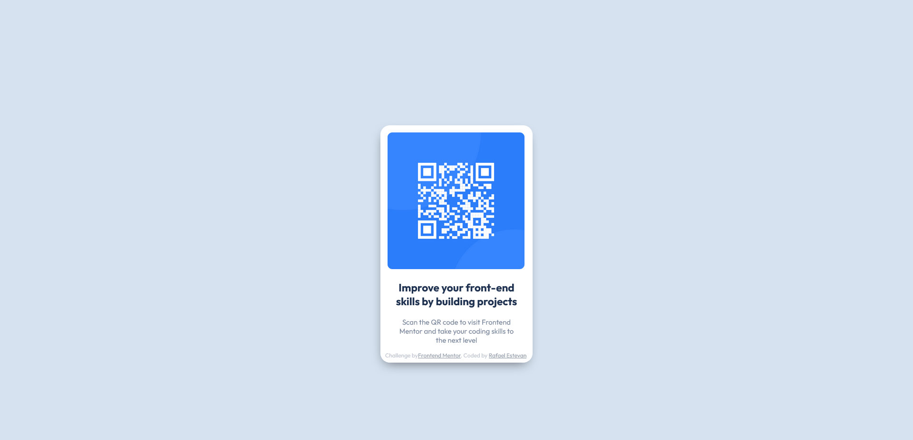

<h1 align="center"> QR code component </h1>

<h3 align="center"><a href="https://rafaelestevan.github.io/qr-code-component/">Page</a> | <a href="https://www.frontendmentor.io/challenges/qr-code-component-iux_sIO_H/hub">Challenge<a/></h3>

# Built with
- Semantic HTML5 markup
- CSS custom properties
- Flexbox
- Desktop-first workflow

# What i learned
It was an excellent challenge in which I was able to learn more about relative measurements and use CSS variables.

# Author
* FrontEnd Mentor [Rafael Estevan](https://www.frontendmentor.io/profile/RafaelEstevan)
* LinkedIn [Rafael Estevan](https://www.linkedin.com/in/rafael-estevan/)
* Twitter [@RafaEstevan_](https://twitter.com/RafaEstevan_)
